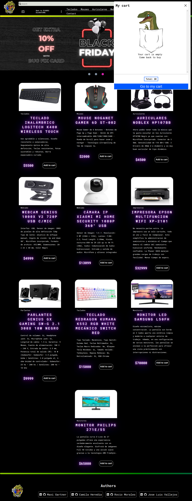

# BugFix

BugFix is an e-commerce project for the Inciatec - Accenture bootcamp. The team members chose the theme of a computer store, this page is inspired by e-sports and the gamer theme.

In this project we had to use HTML, CSS and vanilla JavaScript, but our educators gave us freedom to use any framework or library we wanted.

- The projects are carried out with hundreds of tools, languages and hours of work, but the most important thing for us is the passion for web development 💗

#

## Index

- [Authors](#authors) 🧑‍💼
- [Technologies](#technologies) 🖥️
- [Tools](#tools) 🔨
- [Libraries](#libraries) 📚
- [Frameworks](#frameworks) 📦

#

## Authors

|||||
|:-:|:-:|:-:|:-:|
|Gartner, Maximiliano|Heredia Valverde, Camila Solange|Morales, Maria del Rocío|Vallejos, Jose Luis|
|Frontend Developer|Frontend Developer|Frontend Developer|Scrum Master|
|||||
|||||

#

## Technologies

## Tools

## Libraries

- [JSDoc](https://jsdoc.app/)
- [SweetAlert2](https://sweetalert2.github.io/)

## Frameworks

- [Bootstrap](https://getbootstrap.com/)
- [Google Fonts](https://fonts.google.com/)
#
## How to use

1. Copy the repository link (Github: https://github.com/NikolaiKoz/Iniciatec-Ecommerce-Bug_Fix.github.io)
2. Open the terminal and type `git clone` and paste the link, press enter.
3. Open the project in your code editor
To open the site from Visual Studio Code:
    4.a. Verify that you have the extensions installed (Live Server: https://marketplace.visualstudio.com/items?itemName=ritwickdey.LiveServer)
    5.a. Open the project with Live Server clicking in the "Go live" button in the toolbar at the bottom of the screen
    6.a. The browser with the site opens
To open the site from the browser:
    4.b. Open your browser
    5.b. Press "Ctrl+o" keys
    6.b. In the window that opens select the folder where the proyect is stored
    7.b. Select the "index.html" file inside the folder
    8.b. The site opens in the browser

#
## Saw the project all documentation here

### click on the logo 👇

#

## About the project

    

### Home

* On the main page we find the products rendered in rendercards.js, in said file we find an asynchronous function that makes the request to a backend, from here we obtain the data of the products.

* The shearch bar is a filter that allows us to search for a product by name.

* The filter by category is a filter that allows us to filter the products by category.

 * The cards show an image, description, price and category, but also have hidden elements with a display none with the class name "delete", which are the product id and the stock. these elements are then used to manipulate the local Storage

 * The footer is rendered in the renderFooter.js file, in this file we find a function that makes the request to the authors.json file, from here we obtain the data of the authors and render it in the footer.

 * All the elements of the page are responsive, the page is adapted to mobile devices.

 ### Add to cart Button

- The add to cart button is a function that is called when the user clicks on the add to cart button, this function takes the data of the product and adds it to the local storage.

### Icon Cart

 - The icon cart is a function that is called when the user clicks on the icon cart, this function takes the data of the local storage.
    Shows an alert of the number of products in the cart.
    When the user clicks on the cart, a summary of the added products is rendered, showing the image, the title and the price for the number of products of the same type.

### Cart resume

- The cart resume is a function that is called when the user clicks on the icon cart, this function takes the data of the local storage.
    When the user clicks on the cart, a summary of the added products is rendered, showing the image, the title and the price for the number of products of the same type.
    From here you can modify the quantities of the products.

### Cart resume button

 - This button redirects the user to the purchase page.